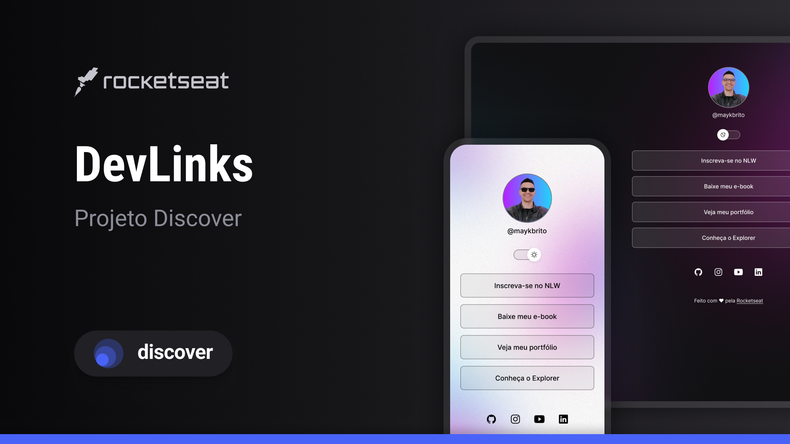

<h1 align="center">DevLinks</h1>

Evento exclusivo e gratuito, promovido pela Rocketseat para ensino de tecnologias WEB.

  <a href="#-tecnologias">Tecnologias</a>&nbsp;&nbsp;&nbsp;|&nbsp;&nbsp;&nbsp;
  <a href="#-projeto">Projeto</a>&nbsp;&nbsp;&nbsp;|&nbsp;&nbsp;&nbsp;
  <a href="#-layout">Layout</a>&nbsp;&nbsp;&nbsp;|&nbsp;&nbsp;&nbsp;
  <a href="#memo-licença">Licença</a>

  

 

  

## 🚀 Tecnologias

Esse projeto foi desenvolvido com as seguintes tecnologias:

- HTML e CSS
- JavaScript
- Git e Github
- Figma

## 💻 Projeto

O **DevLinks** é um agregador de links personalizado, feito para funcionar como um cartão de visitas online ou um "Linktree" pessoal. O projeto permite centralizar redes sociais e links importantes em uma única página acessível e responsiva, contando também com alternância de temas (modo claro e escuro)

## 🔖 Layout

Você pode visualizar o layout do projeto através [DESSE LINK](https://www.figma.com/design/Nwpumaab9vmI6ssQFwTSzr/DevLinks-%E2%80%A2-Projeto-Discover--Community-?node-id=10-620&t=LHCba8Y3jaAlMlBW-1). É necessário ter conta no [Figma](https://figma.com) para acessá-lo.

## 📝 Licença

Esse projeto está sob a licença MIT.

Feito com ♥ by Rocketseat 👋 [Participe da nossa comunidade!](https://discord.gg/rocketseat)
